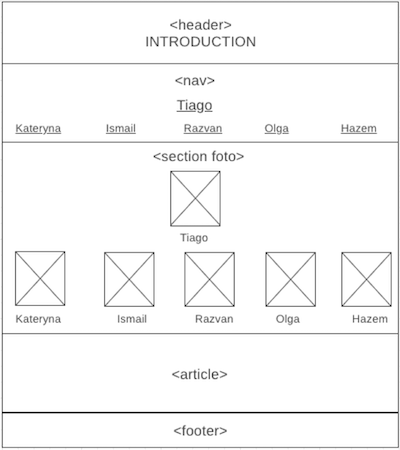

# Development Strategy

> `Integrate-Week-3`

A simple little website of Hack Your Future Group #2

## Wireframe

## 0. Set-Up

> repository owner: Kateryna 

__As a User can see a empty site at the correct URL__
__As a fellow developer I can see the prepared repository__

### Repo

1. Generate a new repo from [w3-validation-template](https://github.com/hackyourfuturebelgium/w3-validation-template)
2. Add a .css file & link to it in the index.html
3. Copy in [this wireframe](./wireframe.png)
4. Add collaborators
5. turn on GitHub Pages
6. Paste in this development strategy and assign the steps
7. Translate this strategy into issues (like in [this demo repo](https://github.com/hackyourfuturebelgium/from-strategy-to-issues))

---

## 1. Introduction

> assigned to `Kateryna`  
> reviewed to `Ismail`

__As a site visitor, I want to know what the web page is called__

### Repository

- [ ] developed on a branch called `introduction`

### HTML

- [ ] A header element ...
- [ ] ... with the page's title
- [ ] ... and class "site-title"

### CSS

- [ ] the "site-title" class

---

## 2.  Navigation

> assigned to `Ismail`  
> reviewed to `Razvan`

__As a site visitor, I want to read an introduction to this web page__

### Repository

- [ ] developed on a branch called `nav`

### HTML

- [ ] A navigattion element ...
- [ ] ... with links on the pages of students
- [ ] ... and class "nav"

### CSS

- [ ] the "nav" class

---

## 3. Section foto

> assigned to `Razvan`  
> reviewed to `Olga`

__As a site visitor, I want to learn about something cool__

### Repository

- [ ] developed on a branch called `foto`

### HTML

- [ ] An section element ...
- [ ] ... with the fotos and names of students
- [ ] ... and class "section"

### CSS

- [ ] the "section" class

---

## 4. Article

> assigned to `Olga`  
> reviewed to `Hazem`

__As a site visitor, I want to know where I can learn more__

### Repository

- [ ] developed on a branch called `article`

### HTML

- [ ] An article element ...
- [ ] ... with the page's main content about group
- [ ] ... and class "article"

### CSS

- [ ] the "article" class

---

## 5. Footer

> assigned to `Hazem`  
> reviewed to `Kateryna`

__As a site visitor, I want to know how I can contact the author__

### Repository

- [ ] developed on a branch called `footer`

### HTML

- [ ] A footer element ...
- [ ] ... with the author's contact info
- [ ] ... and class "footer"

### CSS

- [ ] the "footer" class

---

## 6. Finishing Touches

> assigned to __

__As a perfectionist, I want everything perfect :)__

- Write final, complete README:
  - [makeareadme.com](https://www.makeareadme.com/)
  - [bulldogjob](https://bulldogjob.com/news/449-how-to-write-a-good-readme-for-your-github-project)
  - [meakaakka](https://medium.com/@meakaakka/a-beginners-guide-to-writing-a-kickass-readme-7ac01da88ab3)
- Check for styling errors with a linter & prettify code
- Validate source code on w3 to check for any last mistakes
